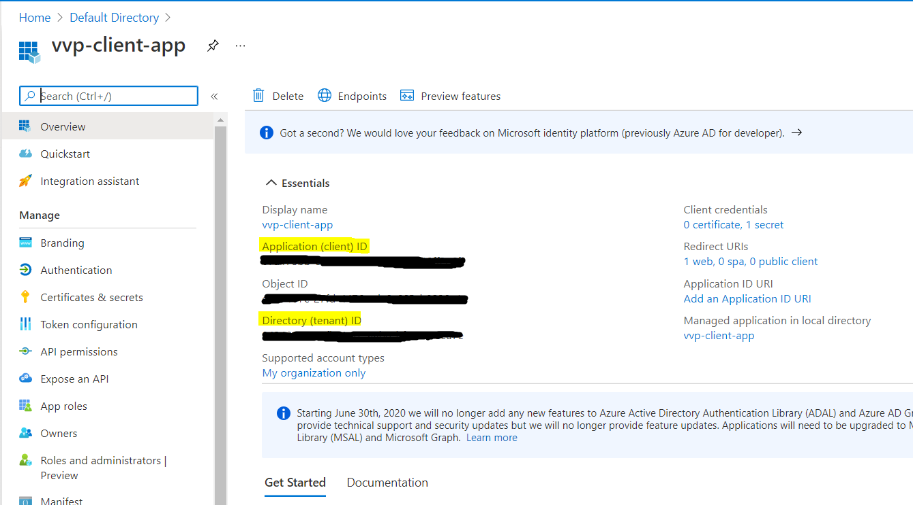
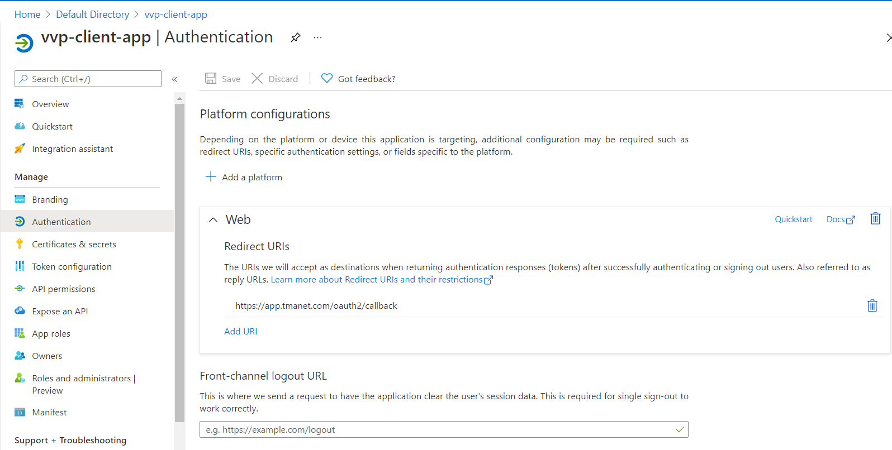
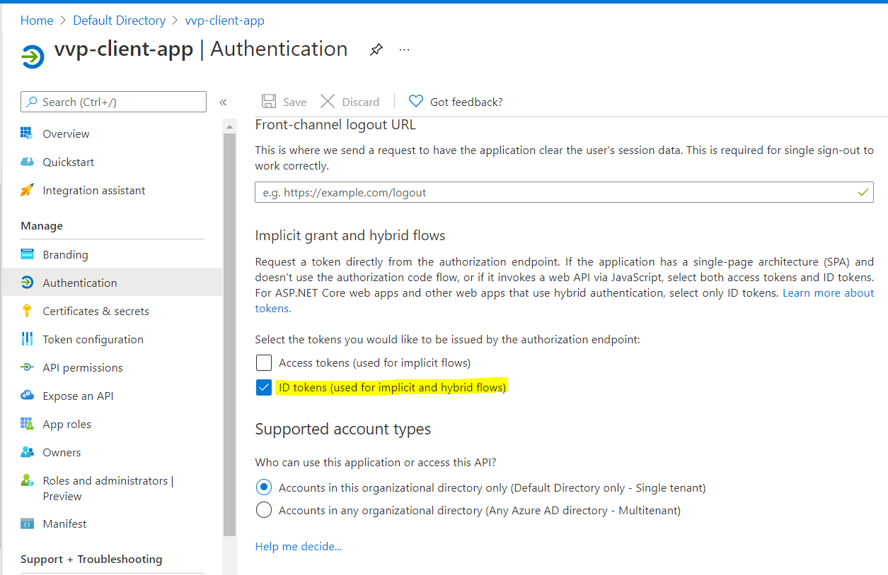
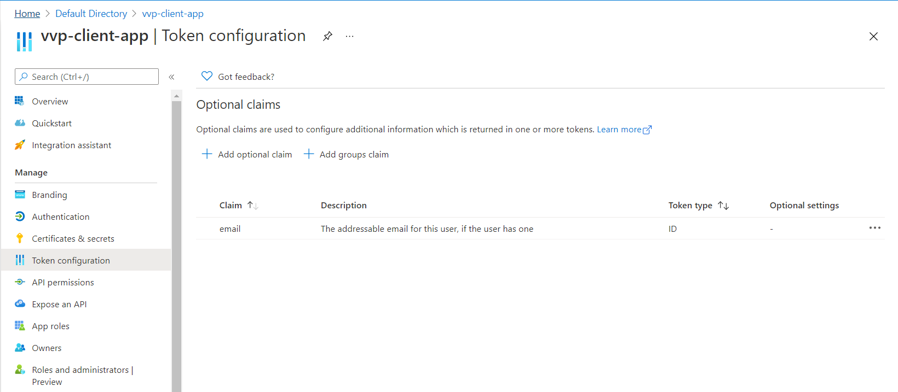
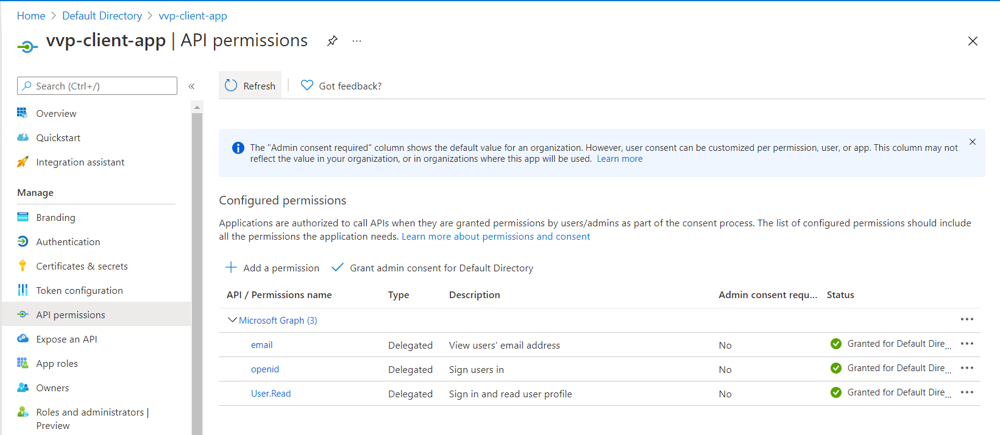

## Reference:
https://www.jetstack.io/blog/istio-oidc/

## Procedure:
**Step 1:** Install Istio (prefer >= v1.8, Istio EnvoyFilter configuration varies version by version)
```bash
git clone https://github.com/nathluu/istio-fleetman.git
cd istio-fleetman/deployment/azure/single-cluster
bash ./2-setup-k8s.sh
```
**Step 2:** Create a secret for the ingress gateway
```bash
unzip istio-oidc.zip
cd istio-oidc
kubectl create secret tls nginx-tls-secret \
  --cert=app.tmanet.com.crt \
  --key=app.tmanet.com.key -n istio-system
```
**Step 3:** Register AAD application  

Client Overview


Authentication



Token configuration  
Add `email` claim


API permission  
Add `openid` and `email` scope, User.Read permission


**Step 4:** Get OIDC configuration from OIDC discovery endpoint  
Set `TENANT_ID` according to your tenant
```bash
TENANT_ID=""
OIDC_DISCOVERY_URL=https://login.microsoftonline.com/${TENANT_ID}/v2.0/.well-known/openid-configuration
OIDC_DISCOVERY_URL_RESPONSE=$(curl $OIDC_DISCOVERY_URL)
OIDC_ISSUER_URL=$(echo $OIDC_DISCOVERY_URL_RESPONSE | jq -r .issuer)
OIDC_JWKS_URI=$(echo $OIDC_DISCOVERY_URL_RESPONSE | jq -r .jwks_uri)
``` 
**Step 5:** Update and apply manifest
```bash
kubectl apply -f app.yaml
kubectl apply -f auth.yaml
kubectl apply -f oauth2-proxy.yaml
kubectl apply -f envoyfilter.yaml
```
**Step 6:** Verify  
Update your `/etc/hosts` file to add DNS record to resolve `app.tmanet.com` to ingress gateway external IP
```bash
kubectl get services/istio-ingressgateway -n istio-system
```
Access https://app.tmanet.com
